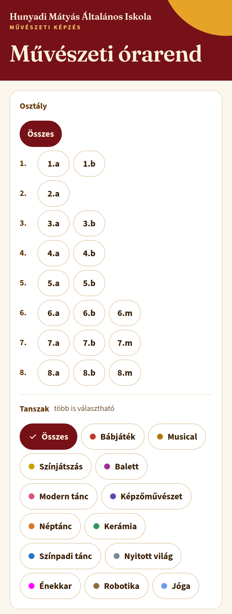
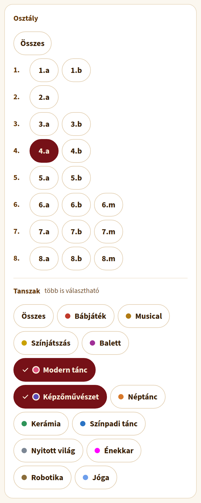
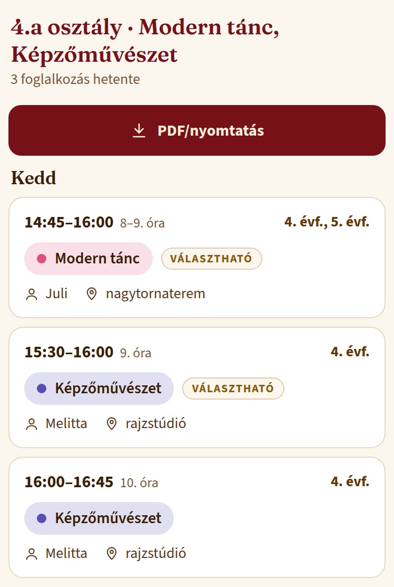
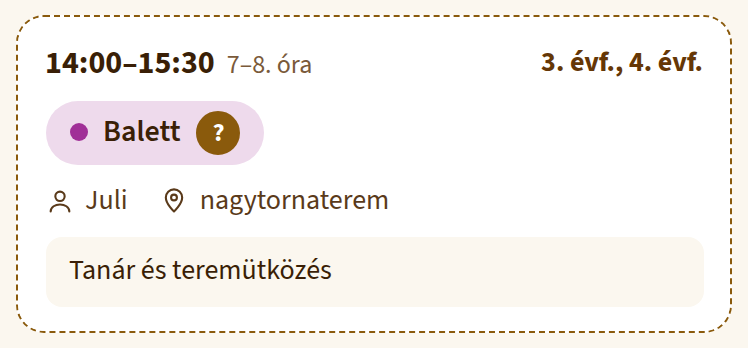
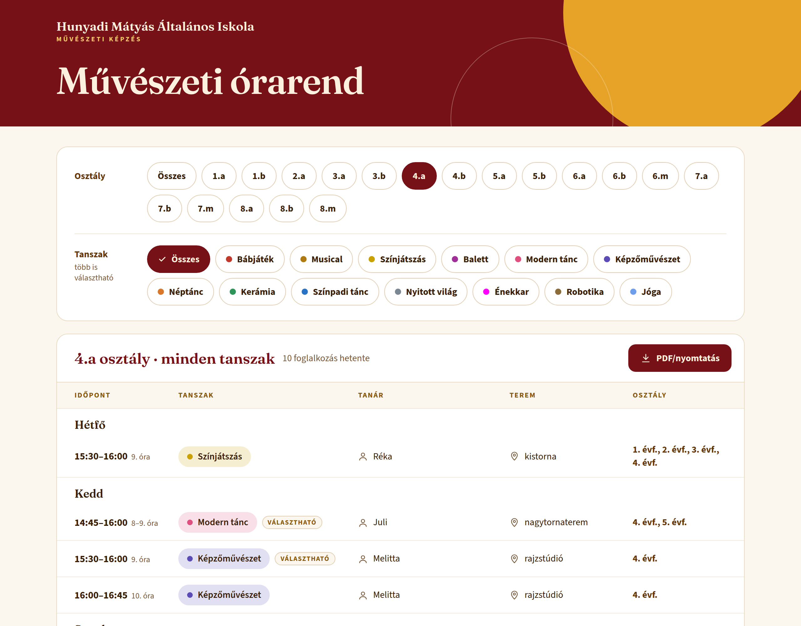
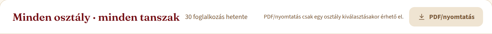
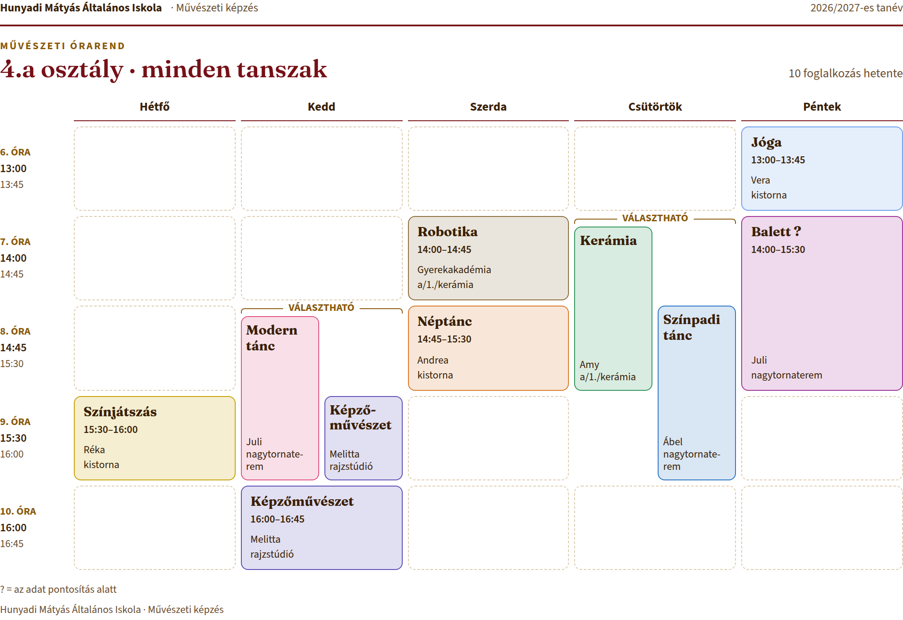

# Művészeti órarend – rövid útmutató szülőknek

A Hunyadi Mátyás Általános Iskola délutáni művészeti foglalkozásainak heti órarendje egy weboldalon érhető el:

**https://fausztg-coder.github.io/art-program-chedule/**

Telefonon és számítógépen is működik, nem kell hozzá regisztráció vagy alkalmazás. Az órarend mindig az iskola aktuális táblázatából frissül.

## 1. Válaszd ki a gyermeked osztályát

Az oldal tetején az **Osztály** sorban koppints a gyermeked osztályára (pl. 4.a). Telefonon az osztályok évfolyamonként külön sorban állnak. Az **Összes** gomb az összes osztály foglalkozását mutatja.

## 2. Szűkíts tanszakra (ha szeretnél)

A **Tanszak** sorban egy vagy több foglalkozást is kiválaszthatsz: koppints rájuk, a kiválasztottak bordóra váltanak, pipát kapnak. Újabb koppintással kiveszed őket. Az **Összes** gomb visszaállít minden tanszakot.

## 3. Olvasd le a foglalkozásokat

Alatta napok szerint látod a foglalkozásokat: az időpontot és hogy hányadik óra, a foglalkozás nevét, a tanárt, a termet és hogy mely évfolyamnak vagy osztálynak szól. A cím alatt látszik, hány foglalkozás van hetente.

**„VÁLASZTHATÓ”**: ha ugyanarra az időpontra több foglalkozás is esik, ezek közül egyet lehet választani.

**Szaggatott keret és „?”**: az adat még pontosítás alatt van. A „?”-re koppintva megjelenik a magyarázat.

Számítógépen ugyanez táblázatszerűen jelenik meg:

## 4. Mentsd el vagy nyomtasd ki (PDF)

Egy osztály kiválasztása után a **PDF/nyomtatás** gombbal egyoldalas, fekvő A4-es órarendet kapsz. „Összes” osztálynál a gomb nem működik – előbb válassz osztályt.

- **Számítógépen:** a megnyíló ablakban a Nyomtató / Cél helyén válaszd a **Mentés PDF-ként** lehetőséget, vagy nyomtasd ki.
- **iPhone-on:** koppints a gombra, majd a nyomtatási előnézetben: Megosztás → **Mentés a Fájlokba**.
- **Androidon:** a nyomtatási ablakban a nyomtató helyén válaszd a **Mentés PDF-ként** lehetőséget.

Tipp: ha a lap tetején vagy alján webcím és dátum is megjelenik, a nyomtatási ablakban a „Fejlécek és láblécek” kikapcsolásával eltüntetheted.

## Jó tudni

- **A választás megmarad:** az oldal megjegyzi, mit választottál legutóbb, így legközelebb ugyanazt látod.
- **Megosztható link:** a böngésző címsorában lévő cím a választásodat is tartalmazza (pl. …`?o=4.a&f=balett`). Ha ezt elküldöd, a másik szülő ugyanazt a nézetet látja.
- **Sárga sáv „Az órarend nem frissült…”:** az oldal éppen nem érte el az iskola táblázatát, ezért a legutóbbi mentett állapotot mutatja a jelzett dátummal. Később töltsd újra az oldalt.
- **Kérdés vagy hiba:** az órarend tartalmával kapcsolatban az iskolát keresd.
